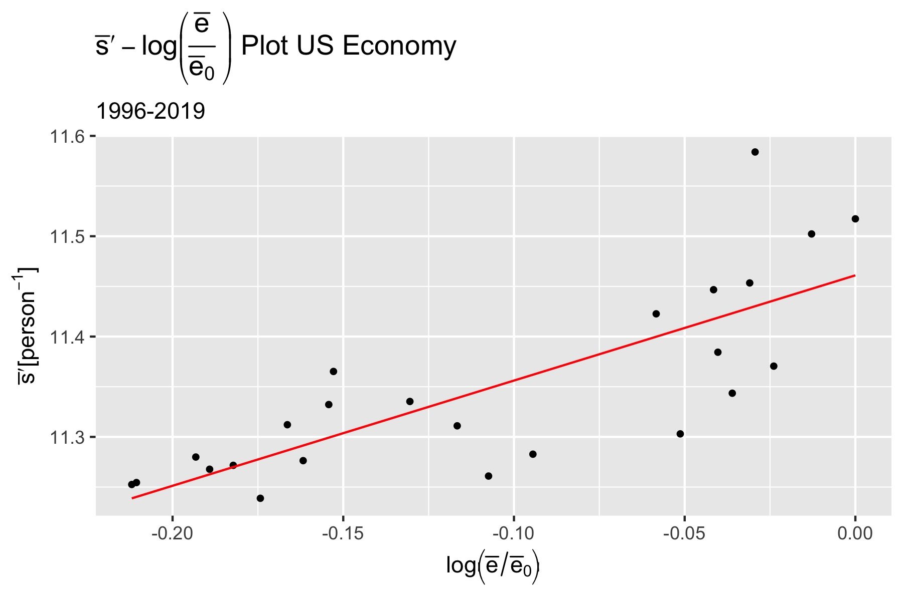
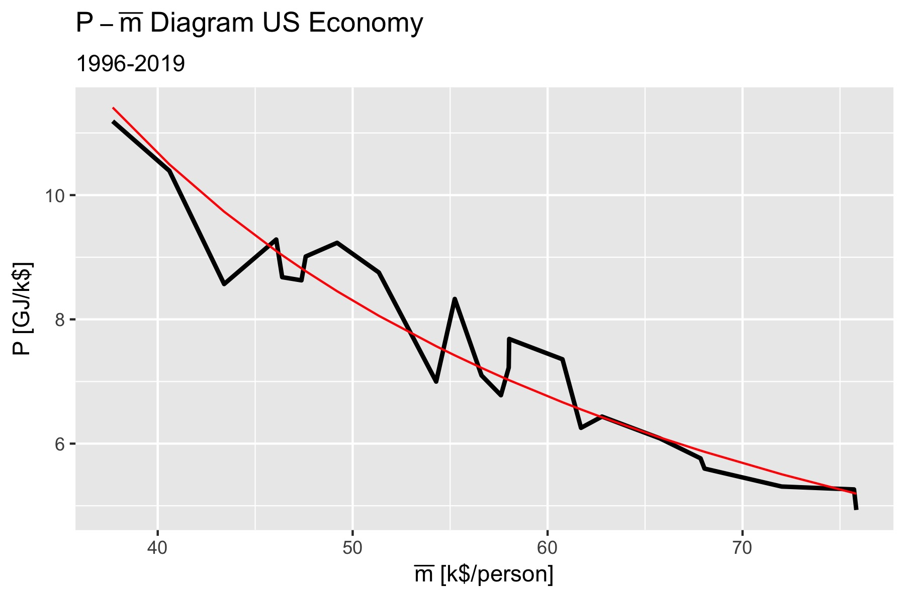

# United States Macroeconomic Analysis

This `R` project looks at the US economy from a statistical mechanical framework.
The project constructs a statistical ensemble using the income distribution of the United States.
The data set comprises income data from 1996-2019.

## Model Data Sources

The model data comes from three different sources.

1. Internal Revenue Service [Income Tax Data](https://www.irs.gov/statistics/soi-tax-stats-individual-statistical-tables-by-size-of-adjusted-gross-income)
2. Energy Information Agency [Open Data API](https://api.eia.gov/)
3. Federal Reserve Bank of St. Louis [FRED API](https://api.stlouisfed.org/fred/)

To avoid having to obtain the API keys, the data has already been downloaded and resides in the [`data/raw/`](data/raw/) directory.
To avoid having to process
the IRS data, the downloaded `*.xls` files have already been parsed into suitable `R` data structures in [`data/processed/irs/`](data/processed/irs/).

## Using the Model

### Setup

The model is developed using [`R-Studio`](https://www.rstudio.com/products/rstudio/download/) and can be installed from that link.
Once `R-Studio` is installed you will need to install the necessary `CRAN` libraries.

To install the libraries, from the R console run:

``` R
install.packages("renv")
```

Once `renv` is installed execute the following from the R console:

``` R
renv::restore()
```

### Estimating the Income Distribution

The income distribution model regression uses HMC( Hamiltonian Monte Carlo) with NUTS (No U-Turn Sampling) in a Bayesian framework to estimate the model's hyper-parameters.
This is done using `rstan` which is an implementation of [`Stan](https://mc-stan.org/).

There are two different distributions that can be selected:

1. [`gibbs_model.stan`](src/gibbs_model.stan)
2. [`maxwell_model.stan`](src/maxwell_model.stan)

The Gibbs model is taken directly from Banerjee and Yakovenko [(2010)](https://arxiv.org/abs/0912.4898) derivation.
Their derivation uses the Gibbs distribution as the basis of the thermal portion of the income distribution and the Pareto distribution for the epithermal portion,

$$
 \begin{align}
   \tag{1}
   f(\bar{e};T^\star,\bar{e}_0,\alpha) = \frac{e^{- \frac{\bar{e}_0}{T^\star} \arctan{\frac{\bar{e}}{\bar{e}_0}}}}{Z
   \left(1 + \left( \frac{\bar{e}}{\bar{e}_0} \right)^2 \right)^\alpha}. \label{eq:1}
 \end{align}
$$

The Maxwell model is derived from the [Maxwell distribution](https://en.wikipedia.org/wiki/Maxwell%E2%80%93Boltzmann_distribution#Distribution_for_the_energy) in the same manner that the Gibbs distribution was using the stationary Fokker-Plank equation to include the Pareto portion of the distribution.

The Gibbs distribution  provides the better fit of the Adjusted Gross Income (AGI), while the Maxwell distribution provides the better fit of the Taxable Income (TI).

By default, [`income_model_regression.R`](src/income_model_regression.R) is configured to follow the same method and dataset of Banerjee and Yakoveno (2010).
The regression can be configured to use the other distribution or other datasets, by modifying the two variables, `fitModel` and `fitData`,

``` R
# Select Model and Load Data
fitModel <- "gibbs_model.stan"
# fitModel <- "maxwell_model.stan"
#
# Select the appropriate table either "11_agi", "11_ti", or "21"
table <- "11_agi"
```

Once configured, the R script can be run from the console using,

``` R
source("src/income_model_regression.R")
```

This will generate an output file in `data/processed/stan/[gibbs_model.stan | maxwell_model.stan]` with a name based on the ensemble's data set depending on the configuration.

By default, the regression will run 4 simultaneous chains that are used to test for convergence.
This can be adjusted by setting `nChains` to the desired number of chains.

To examine the Stan output, you will need to install `shinystan`

### Estimating Remaining Ensemble Parameters

The remaining ensemble parameters are estimated using [`aggregate_data.R`](src/aggregate_data.R).
This file is configured similarly to `income_model_regression.R`,

``` R
# Configure the analysis
fitModel <- "gibbs_model.stan"
# fitModel <- "maxwell_model.stan"

# Select the appropriate table either "11_agi", "11_ti", or "21"
table <- "11_agi"
```

Once configured, the R script can be run from the console using,

``` R
source("src/aggregate_data.R")
```

#### Equation of State

This model does a two step regression to evaluate the parameters of the model,

$$
\begin{align}
  \tag{2}
  \bar{s} = \bar{s}_0 + R \left[\log\left(\frac{\bar{e}}{\bar{e}_0}\right)^c + \log\frac{\bar{m}}{\bar{m}_0}\right]. \label{eq:2}
\end{align}
$$

Where the regression coefficients are: initial utility $\bar{s}_0$, the return to scale of money $R$, and the value capacity of the individual $c$.
The dependent variable is the utility $\bar{s}$ and the independent variables are the per capita exergy input $\bar{e}$ and the average income $\bar{m}$ and their associated initial values $\bar{e}_0$ and $\bar{m}_0$ respectively.
This model is a slight adaptation of Callen's (1985, p. 68) equation 3.38 which is the equation of state for an ideal gas.

We can define the economic temperature, $T$, as

$$
\begin{align}
  \tag{3}
  T = P\, T^\star. \label{eq:3}
\end{align}
$$

Where $P$ is the value of money and $T^\star$ is a regression parameter of equation $\eqref{eq:1}$.

The first regression considers the relationship

$$
\begin{align}
  \tag{4}
  P\,\bar{m} = R\,T, \label{eq:4}
\end{align}
$$

which we can rewrite as $\bar{m} = R\,T^\star$.
This results in $R=1.23$ and a fit summary of,

```bash
Call:
lm(formula = M ~ 0 + T, data = data_input)

Residuals:
    Min      1Q  Median      3Q     Max 
-8730.5 -2005.2   340.7  1781.0  4603.6 

Coefficients:
  Estimate Std. Error t value Pr(>|t|)    
T  1.23011    0.01304   94.32   <2e-16 ***
---
Signif. codes:  0 ‘***’ 0.001 ‘**’ 0.01 ‘*’ 0.05 ‘.’ 0.1 ‘ ’ 1

Residual standard error: 2990 on 23 degrees of freedom
Multiple R-squared:  0.9974, Adjusted R-squared:  0.9973 
F-statistic:  8896 on 1 and 23 DF,  p-value: < 2.2e-16
```

With the plot of the output


The next step is to model the relationship between utility, $\bar{s}$, and the per capita exergy input, $\bar{e}$.
To do this we define a new independent parameter $\bar{s}^\prime$,

$$
\begin{align}
  \tag{5}
  \bar{s}^\prime = \bar{s} - R \log\frac{\bar{m}}{\bar{m}_0} = \bar{s}_0 + c\,R \log \frac{\bar{e}}{\bar{e}_0}. \label{eq:5}
\end{align}
$$

Where the ensemble's remaining entropy, $\bar{s}^\prime$, is computed from the appropriate distribution, e.g. equation $\eqref{eq:5}$, $\bar{e}_0 = 392.1858 \left[GJ\right]$, and $\bar{m}_0 = 37.689 [k$\$ $/person]$.

When the package is run, it will provide an output something like

``` bash
Call:
lm(formula = S ~ U, data = data_input)

Residuals:
     Min       1Q   Median       3Q      Max 
-0.10421 -0.03564  0.01247  0.02651  0.15374 

Coefficients:
            Estimate Std. Error t value Pr(>|t|)    
(Intercept) 11.46101    0.02229 514.067  < 2e-16 ***
U            1.04863    0.17461   6.006 4.81e-06 ***
---
Signif. codes:  0 ‘***’ 0.001 ‘**’ 0.01 ‘*’ 0.05 ‘.’ 0.1 ‘ ’ 1

Residual standard error: 0.05948 on 22 degrees of freedom
Multiple R-squared:  0.6211, Adjusted R-squared:  0.6039 
F-statistic: 36.07 on 1 and 22 DF,  p-value: 4.81e-06
```

The parameters $R$, $c$, and $\bar{s}_0$ are

``` R
print(R)
print(c)
print(s_0)

#        R
# 1.230111
#         c
# 0.8524645
#      s_0
# 11.46101
```

With the plot of the output


The three remaining economic parameters are calculated using the following relationships:

1. $T$: $\bar{e} = c\,R\,T$
2. $P$: Equation $\eqref{eq:3}$
3. $\mu$:  $\mu = T\left[(c + 1) R - \bar{s}\right]$

To see all of the ensemble's parameters run,

```R
View(specEcon)
```

#### The Economic Path - A Polytropic Process

Looking at the relationship between $P$ and $\bar{m}$ we can model the expansion in nominal wages a polytropic process,

$$
\begin{align}
  \tag{6}
  \log P = \log C - n \log \bar{m}. \label{eq:6}
\end{align}
$$

The regression used $\bar{m}$ with units of $[k$\$ $/person]$, resulting in an output of,

``` bash
Call:
lm(formula = lambda ~ M, data = data_poly)

Residuals:
     Min       1Q   Median       3Q      Max 
-0.12745 -0.04080 -0.01343  0.02691  0.11535 

Coefficients:
            Estimate Std. Error t value Pr(>|t|)    
(Intercept)  6.51900    0.26834   24.29  < 2e-16 ***
M           -1.12539    0.06669  -16.88 4.49e-14 ***
---
Signif. codes:  0 ‘***’ 0.001 ‘**’ 0.01 ‘*’ 0.05 ‘.’ 0.1 ‘ ’ 1

Residual standard error: 0.06174 on 22 degrees of freedom
Multiple R-squared:  0.9283, Adjusted R-squared:  0.925 
F-statistic: 284.8 on 1 and 22 DF,  p-value: 4.486e-14
```

with the proportionality constant and the polytropic index,

```R
print(C)
print(n)
#        C 
# 677.8968 
#        n 
# 1.125394 
```

With the plot of the output


With these relationships, we can fully describe the system and evaluate changes in policy that effect the regression parameters, the regression inputs,  and/or the thermodynamic path (monetary and energy policy).

## References

* Banerjee, A., & Yakovenko, V. M. (2010). Universal patterns of inequality. New Journal of Physics, 12, 1-25. doi:10.1088/1367-2630/12/7/075032
* Callen, H. B. (1985). Thermodynamics and an Introduction to Thermostatistics (2nd ed.). New York: John Wiley & Sons.
* Energy Information Agency (2022). Open Data. <https://www.eia.gov/opendata/index.php>.
* Federal Reserve Bank of St. Louis. (2022). FRED Economic Data API. <https://fred.stlouisfed.org/docs/api/fred/>.
* Internal Revenue Service (2022). SOI Tax Stats - Individual Statistical Tables by Size of Adjusted Gross Income. <https://www.irs.gov/statistics/soi-tax-stats-individual-statistical-tables-by-size-of-adjusted-gross-income>.
* Lawrence Livermore National Laboratory (2022). Estimated U.S. Energy Consumption in 2021. [LLNL-MI-410527](https://flowcharts.llnl.gov/sites/flowcharts/files/2022-04/Energy_2021_United-States_0.png).
