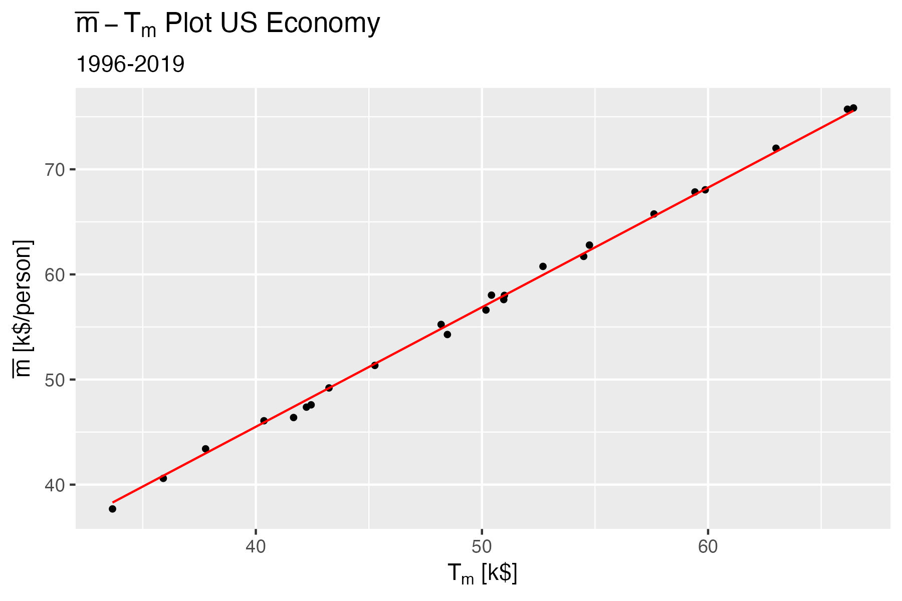
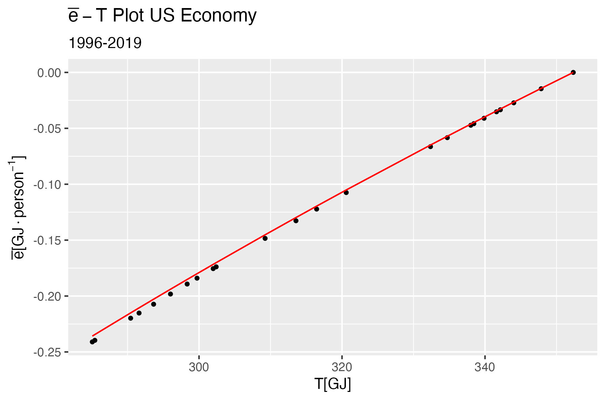
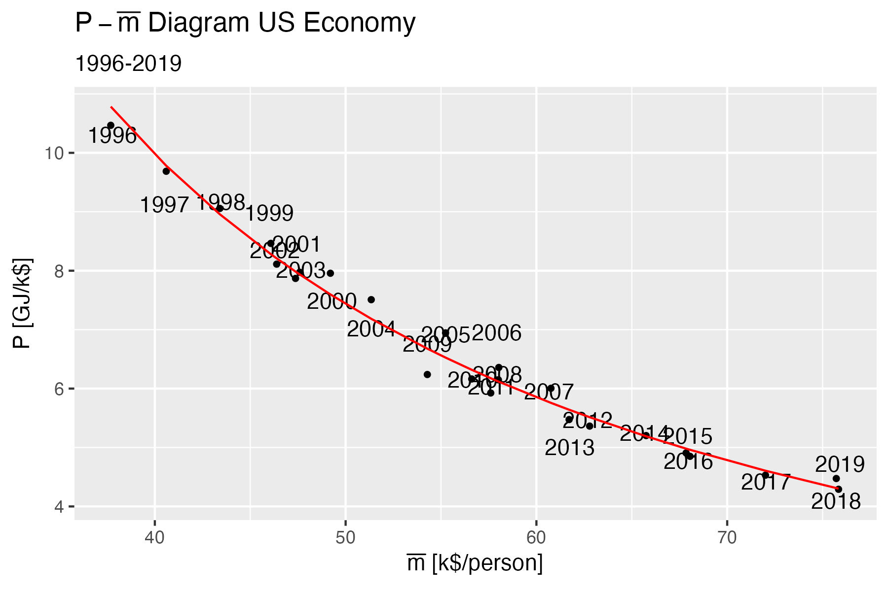

# United States Macroeconomic Analysis

This `R` project looks at the US economy from a statistical mechanical framework.
The project constructs a statistical ensemble using the income distribution of the United States.
The data set comprises income data from 1996-2019.

## Model Data Sources

The model data comes from three different sources.

1. Internal Revenue Service [Income Tax Data](https://www.irs.gov/statistics/soi-tax-stats-individual-statistical-tables-by-size-of-adjusted-gross-income)
2. Energy Information Agency [Open Data API](https://api.eia.gov/)
3. Federal Reserve Bank of St. Louis [FRED API](https://api.stlouisfed.org/fred/)

To avoid having to obtain the API keys, the data has already been downloaded and resides in the [`data/raw/`](data/raw/) directory.
To avoid having to process
the IRS data, the downloaded `*.xls` files have already been parsed into suitable `R` data structures in [`data/processed/irs/`](data/processed/irs/).

## Using the Model

### Setup

The model is developed using [`R-Studio`](https://www.rstudio.com/products/rstudio/download/) and can be installed from that link.
Once `R-Studio` is installed you will need to install the necessary `CRAN` libraries.

To install the libraries, from the R console run:

``` R
install.packages("renv")
```

Once `renv` is installed execute the following from the R console:

``` R
renv::restore()
```

### Estimating the Income Distribution

The income distribution model regression uses HMC( Hamiltonian Monte Carlo) with NUTS (No U-Turn Sampling) in a Bayesian framework to estimate the model's hyper-parameters.
This is done using `rstan` which is an implementation of [`Stan](https://mc-stan.org/).

There are two different distributions that can be selected:

1. [`gibbs_model.stan`](src/gibbs_model.stan)
2. [`maxwell_model.stan`](src/maxwell_model.stan)

The Gibbs model is taken directly from Banerjee and Yakovenko [(2010)](https://arxiv.org/abs/0912.4898) derivation.
Their derivation uses the Gibbs distribution as the basis of the thermal portion of the income distribution and the Pareto distribution for the epithermal portion,

$$
 \begin{align}
   \tag{1}
   f(\bar{e};T^\star,\bar{e}_0,\alpha) = \frac{e^{- \frac{\bar{e}_0}{T^\star} \arctan{\frac{\bar{e}}{\bar{e}_0}}}}{Z
   \left(1 + \left( \frac{\bar{e}}{\bar{e}_0} \right)^2 \right)^\alpha}.
 \end{align}
$$

The Maxwell model is derived from the [Maxwell distribution](https://en.wikipedia.org/wiki/Maxwell%E2%80%93Boltzmann_distribution#Distribution_for_the_energy) in the same manner that the Gibbs distribution was using the stationary Fokker-Plank equation to include the Pareto portion of the distribution.

The Gibbs distribution  provides the better fit of the Adjusted Gross Income (AGI), while the Maxwell distribution provides the better fit of the Taxable Income (TI).

By default, [`income_model_regression.R`](src/income_model_regression.R) is configured to follow the same method and dataset of Banerjee and Yakoveno (2010).
The regression can be configured to use the other distribution or other datasets, by modifying the two variables, `fitModel` and `fitData`,

``` R
# Select Model and Load Data
fitModel <- "gibbs_model.stan"
# fitModel <- "maxwell_model.stan"
#
# Select the appropriate table either "11_agi", "11_ti", or "21"
table <- "11_agi"
```

Once configured, the R script can be run from the console using,

``` R
source("src/income_model_regression.R")
```

This will generate an output file in `data/processed/stan/[gibbs_model.stan | maxwell_model.stan]` with a name based on the ensemble's data set depending on the configuration.

By default, the regression will run 4 simultaneous chains that are used to test for convergence.
This can be adjusted by setting `nChains` to the desired number of chains.

To examine the Stan output, you will need to install `shinystan`

### Estimating Remaining Ensemble Parameters

The remaining ensemble parameters are estimated using [`aggregate_data.R`](src/aggregate_data.R).
This file is configured similarly to `income_model_regression.R`,

``` R
# Configure the analysis
fitModel <- "gibbs_model.stan"
# fitModel <- "maxwell_model.stan"

# Select the appropriate table either "11_agi", "11_ti", or "21"
table <- "11_agi"
```

Once configured, the R script can be run from the console using,

``` R
source("src/aggregate_data.R")
```

#### Equation of State

This model does a three regressions to evaluate the parameters of the model,

$$
\begin{align}
  \tag{2}
  \bar{s} = \bar{s}_0 + R \left[\log\left(\frac{\bar{e}}{\bar{e}_0}\right)^c + \log\frac{\bar{m}}{\bar{m}_0}\right].
\end{align}
$$

Where the regression coefficients are: initial utility $\bar{s}_0$, the return to scale of money $R$, and the value capacity of the individual $c$.
The dependent variable is the utility $\bar{s}$ and the independent variables are the per capita exergy input $\bar{e}$ and the average income $\bar{m}$ and their associated initial values $\bar{e}_0$ and $\bar{m}_0$ respectively.
This model is a slight adaptation of Callen's (1985, p. 68) equation 3.38 which is the equation of state for an ideal gas.
Since entropy, $\bar{s}$, is economic utility, this is a two parameter, energy and money, Cobb-Douglas Production function.

The first regression is to estimate $R$.
We can construct a canonical ensemble with any observable, it does not necessarily have to be energy.
We have such an ensemble with equation (1), however it does not purely follow the canonical expoential distribution.
To resolove this we will follow Matsoukas (p. 92, 2018) generalized cluster ensemble, and separate Banerjee and Yakovenko's model into the relevant components,

$$
\begin{align}
  \tag{3}
  \log \omega - \log q = \beta_1 \bar{x}_1.
\end{align}
$$

We recognize $\log \omega$ as being the associated von Neumann entropy, $\log q$ as being $\log Z$ from equation (1), $\bar{x}_1$ as being the average income $\bar{m}$ for a given year, and the term $\beta_1$ is the inverse monetary temperature, $T^\star$.

We compute $T^\star$ for a given year as being

$$
\begin{align}
  \tag{4}
  T^\star = \frac{\bar{m}}{\log \omega - \log Z}.
\end{align}
$$

While money is important, it can be easily debased; we need to look at shifting to an energy basis to provide an absolute metric of value.
Since value is related to the Hamiltonian, we will use the exergy input into the economy.
We observe that the value of the dollar for a given year is fixed, so the distribution of value will be identical to the distribution of income, thus

$$
\begin{align}
  \tag{5}
  T = \frac{\bar{e}}{\log \omega - \log Z}.
\end{align}
$$

We can define the economic temperature, $T$, as

$$
\begin{align}
  \tag{6}
  T = P\, T^\star.
\end{align}
$$

Using the familiar ideal gas equation where we replace volume with money and pressure with equation (6), we have

$$
\begin{align}
  \tag{7}
  \bar{m} = R \, T^\star.
\end{align}
$$

Similarly for energy we have

$$
\begin{align}
  \tag{8}
  \bar{e} = c\,R \, T.
\end{align}
$$

We then use equation (7) to determine the coefficient $R$, ressulting in $R=1.14$ and a fit summary of,

```bash
Call:
lm(formula = M ~ 0 + Tstar, data = specEcon)

Residuals:
     Min       1Q   Median       3Q      Max 
-1020.91  -398.36     3.77   350.50   810.06 

Coefficients:
      Estimate Std. Error t value Pr(>|t|)    
Tstar 1.137651   0.002032   559.9   <2e-16 ***
---
Signif. codes:  0 ‘***’ 0.001 ‘**’ 0.01 ‘*’ 0.05 ‘.’ 0.1 ‘ ’ 1

Residual standard error: 504.2 on 23 degrees of freedom
Multiple R-squared:  0.9999,	Adjusted R-squared:  0.9999 
F-statistic: 3.135e+05 on 1 and 23 DF,  p-value: < 2.2e-16
```

With the plot of the output


Using equation (8) and our knowledge of $R$, we can determine $c=0.988$ with a fit summary of 

``` bash
Call:
lm(formula = E ~ 0 + T, data = specEcon)

Residuals:
    Min      1Q  Median      3Q     Max 
-7.4854 -1.7528  0.7924  2.2513  5.4146 

Coefficients:
  Estimate Std. Error t value Pr(>|t|)    
T   1.1353     0.0023   493.6   <2e-16 ***
---
Signif. codes:  0 ‘***’ 0.001 ‘**’ 0.01 ‘*’ 0.05 ‘.’ 0.1 ‘ ’ 1

Residual standard error: 3.514 on 23 degrees of freedom
Multiple R-squared:  0.9999,	Adjusted R-squared:  0.9999 
F-statistic: 2.437e+05 on 1 and 23 DF,  p-value: < 2.2e-16
```

With the plot of the output


The parameters $R$, $c$, and $\bar{s}_0$ are

``` R
print(params)

$R
[1] 1.137651

$c
[1] 0.9979318

$s_0
[1] 11.50636

$gamma
[1] 2.140008
```

The two remaining economic parameters are calculated using the following relationships:

1. $P$: Equation (3)
2. $\mu$:  $\mu = T\left[(c + 1) \, R - \bar{s}\right]$

To see all of the ensemble's parameters run,

```R
view(specEcon)
```

#### The Economic Path - A Polytropic Process

Looking at the relationship between $P$ and $\bar{m}$ we can model the expansion in nominal wages a polytropic process,

$$
\begin{align}
  \tag{9}
  \log P = \log C - n \log \bar{m}.
\end{align}
$$

The regression used $\bar{m}$ with units of $[k\$ /person]$, resulting in an output of,

``` bash
Call:
lm(formula = P ~ M, data = data_poly)

Residuals:
      Min        1Q    Median        3Q       Max 
-0.054344 -0.017852 -0.003016  0.016943  0.053135 

Coefficients:
            Estimate Std. Error t value Pr(>|t|)    
(Intercept)  7.22581    0.12346   58.53   <2e-16 ***
M           -1.33864    0.03068  -43.63   <2e-16 ***
---
Signif. codes:  0 ‘***’ 0.001 ‘**’ 0.01 ‘*’ 0.05 ‘.’ 0.1 ‘ ’ 1

Residual standard error: 0.0284 on 22 degrees of freedom
Multiple R-squared:  0.9886,	Adjusted R-squared:  0.9881 
F-statistic:  1904 on 1 and 22 DF,  p-value: < 2.2e-16
```

with the proportionality constant and the polytropic index,

```R
print(params_poly$C)
print(params_poly$n)
#        C 
# 1374.455 
#        n 
# 1.338639 
```

With the plot of the output


With these relationships, we can fully describe the system and evaluate changes in policy that effect the regression parameters, the regression inputs,  and/or the thermodynamic path (monetary and energy policy).

## References

* Banerjee, A., & Yakovenko, V. M. (2010). Universal patterns of inequality. New Journal of Physics, 12, 1-25. doi:10.1088/1367-2630/12/7/075032
* Callen, H. B. (1985). Thermodynamics and an Introduction to Thermostatistics (2nd ed.). New York: John Wiley & Sons.
* Energy Information Agency (2022). Open Data. <https://www.eia.gov/opendata/index.php>.
* Federal Reserve Bank of St. Louis. (2022). FRED Economic Data API. <https://fred.stlouisfed.org/docs/api/fred/>.
* Internal Revenue Service (2022). SOI Tax Stats - Individual Statistical Tables by Size of Adjusted Gross Income. <https://www.irs.gov/statistics/soi-tax-stats-individual-statistical-tables-by-size-of-adjusted-gross-income>.
* Lawrence Livermore National Laboratory (2022). Estimated U.S. Energy Consumption in 2021. [LLNL-MI-410527](https://flowcharts.llnl.gov/sites/flowcharts/files/2022-04/Energy_2021_United-States_0.png).
* Matsoukas, T. (2018). Generalized Statistical Thermodynamics: Thermodynamics of Probability Distributions and Stochastic Processes. Switzerland: Springer.
